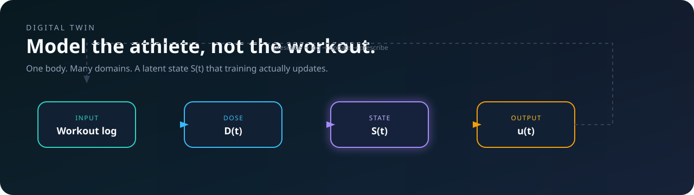
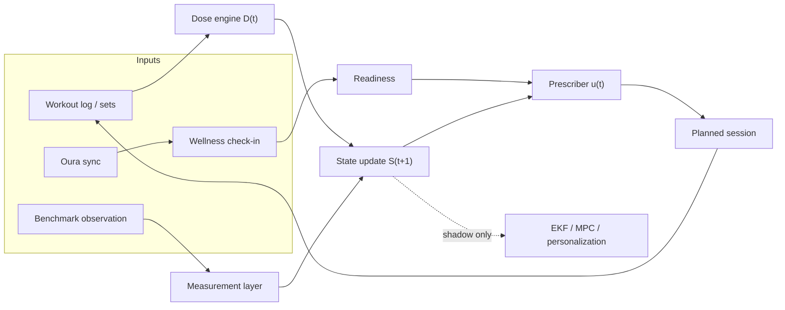
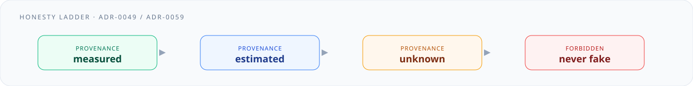
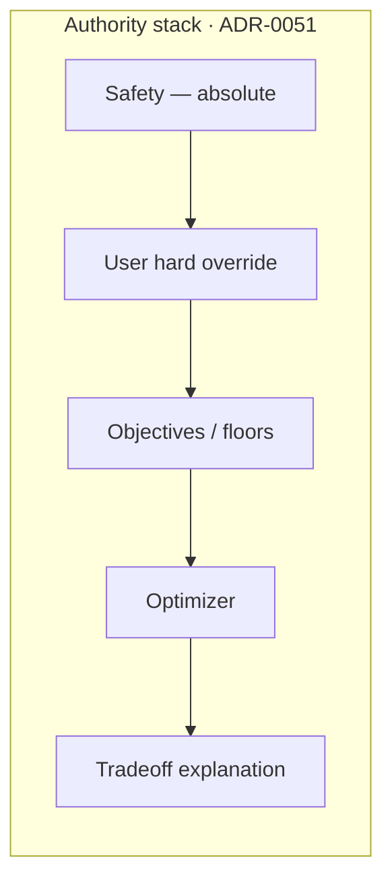
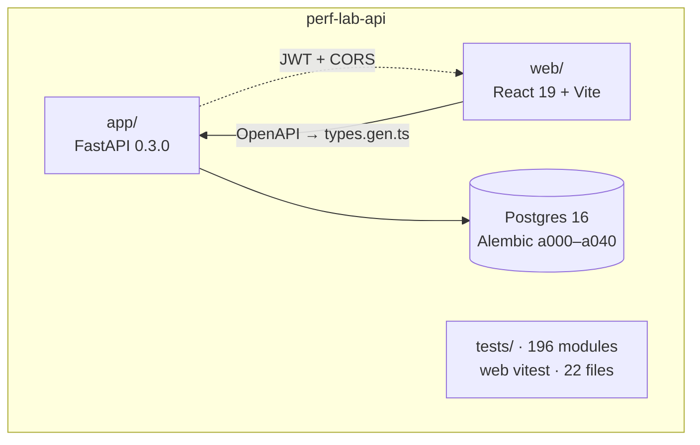
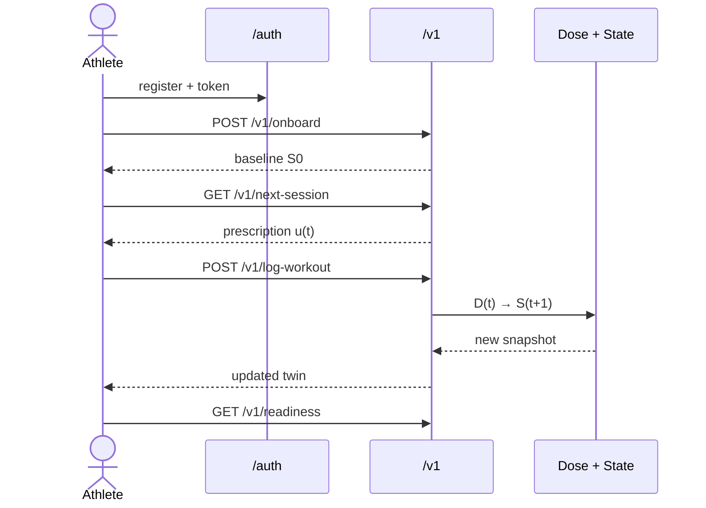

# Performance Lab

<p align="center">
  <a href="https://github.com/markwuenschel-dev/perf-lab-api/actions/workflows/ci.yml"></a>
  
  
  
  
  
  
  
  
  
  
</p>

<p align="center"><strong>A multi-domain training engine that models the athlete, not the workout.</strong></p>

<p align="center">
  FastAPI digital twin · React control console · Alembic/Postgres · JWT · Oura
</p>



Most training apps store sports: a 10K time, a squat 1RM, a race calendar. This repo stores **one body**. A latent state `S(t)` — capacity, fatigue, tissue, skill, habit — is updated by a stress dose `D(t)` and emits the next useful session `u(t)`.

The backend is `app.main:app`. The control console lives in `web/` in this same repository. Live: [perflab.44-198-76-44.nip.io](https://perflab.44-198-76-44.nip.io).

---

## How the twin thinks



| Symbol | Meaning | Owner |
|---|---|---|
| `D(t)` | Stress dose of one session | `app/logic/dose_engine_v0.py` |
| `S(t)` | Unified athlete state (append-only history) | `app/services/state_service.py` |
| `u(t)` | Next prescribed session | `app/services/prescription_service.py` |
| Readiness | One backend-owned number, never recomputed in the client | `GET /v1/readiness` · [PDR-0005](docs/pdr/0005-one-backend-owned-readiness-number.md) |

Missing wellness is a **gap**, not a midpoint. A fixture value must never look measured.





The model **informs and self-limits**. It does not block or silently overwrite the athlete ([PDR-0010](docs/pdr/0010-model-self-limits-never-blocks-user.md)).

---

## Repo map



```text
app/            FastAPI, services, engine, shadow EKF/MPC
web/            React control console (pnpm, Vite, Tailwind 4)
alembic/        Schema — Alembic only, never create_all
tests/          pytest + Postgres integration (REQUIRE_DB in CI)
docs/adr        Architecture decision records
docs/pdr        Product decision records
.github/        CI: import + OpenAPI + pytest/ruff/pyright + web build/vitest
```

---

## Athlete loop



**Public:** `GET /ping` · `POST /v1/simulate-dose`

**Auth (no `/v1` prefix):** `POST /auth/register` · `POST /auth/token` · `GET /auth/me`

**Twin (JWT):** onboard, profile, history, log-workout, next-session, planning, wellness, readiness, objectives, macrocycles, benchmarks, dashboard, exercises, weak-points, Oura, shadow telemetry.

Full contract: [`/docs`](http://127.0.0.1:8000/docs) locally, or [`docs/API_GUIDE.md`](docs/API_GUIDE.md).

---

## Quickstart

Requires **Python 3.11+**, **uv**, **Node 22**, **pnpm 10**, and **Postgres 16**.

```bash
git clone https://github.com/markwuenschel-dev/perf-lab-api.git
cd perf-lab-api
cp .env.example .env          # set SECRET_KEY + DATABASE_URL

docker compose up -d postgres # user perfuser / db perflab / port 5432
uv sync --extra dev
uv run alembic upgrade head
uv run python -m app.scripts.seed_exercises

uv run uvicorn app.main:app --reload
# http://127.0.0.1:8000/docs    http://127.0.0.1:8000/ping
```

```bash
cd web
pnpm install
pnpm run dev                  # Vite console, talks to the API
```

Do **not** `pip install -r requirements.txt`. [`pyproject.toml`](pyproject.toml) + [`uv.lock`](uv.lock) are the source of truth. The root `main.py` entrypoint is deprecated — use `app.main:app`.

Production refuses to boot on a published `SECRET_KEY`, unpinned CORS, or `DEBUG=true`. Pin `ALLOWED_ORIGINS`. See [`docs/DEPLOY.md`](docs/DEPLOY.md).

---

## Verify

```bash
uv run python -c "import app.main; print('ok')"
uv run python -m app.scripts.export_openapi --check
uv run ruff check .
uv run pyright
uv run pytest -q -n auto

cd web
pnpm run tokens:check
pnpm run test
pnpm run build
```

CI runs the same gates on every PR ([`.github/workflows/ci.yml`](.github/workflows/ci.yml)): app import, committed OpenAPI, pytest with `--cov-fail-under=83`, ruff, pyright, `types.gen.ts` freshness, token check, `tsc` + Vite build, vitest.

---

## Docs

| | |
|---|---|
| [Architecture](docs/System_Architecture.md) | Runtime, routers, the `S(t)` loop |
| [ADRs](docs/adr/) | Settled engineering decisions |
| [PDRs](docs/pdr/) | Settled product thesis |
| [Redesign roadmap](docs/REDESIGN_ROADMAP.md) | Wave 2 phases (P6/P8/P9 shipped) |
| [Deploy](docs/DEPLOY.md) | EC2 docker-compose runbook |
| [CONTEXT.md](CONTEXT.md) | Domain vocabulary — read this before changing engine code |

---

## License

MIT — see [LICENSE](LICENSE).
